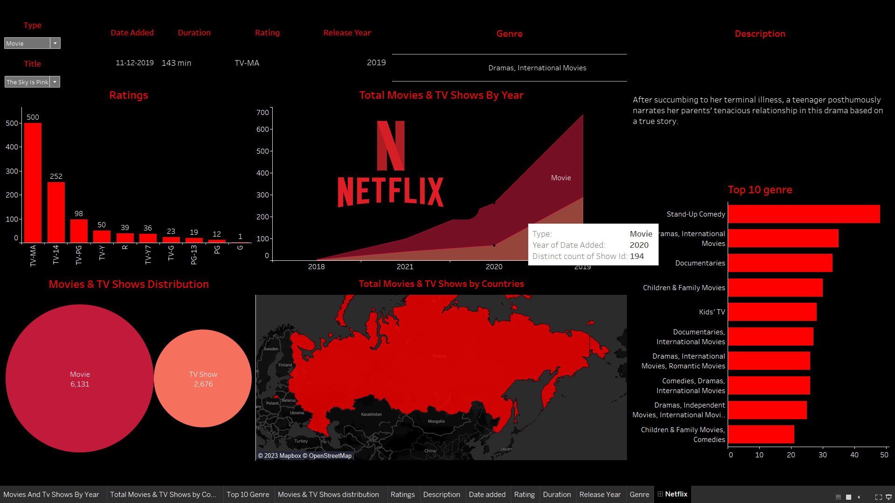
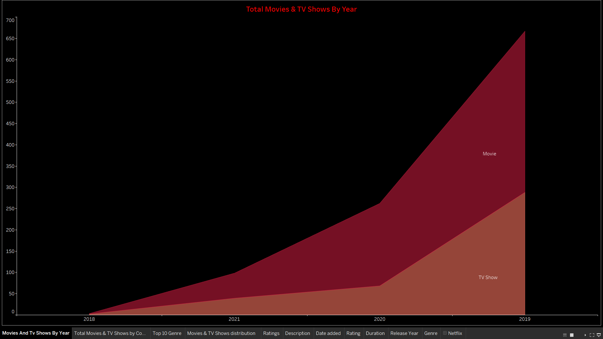
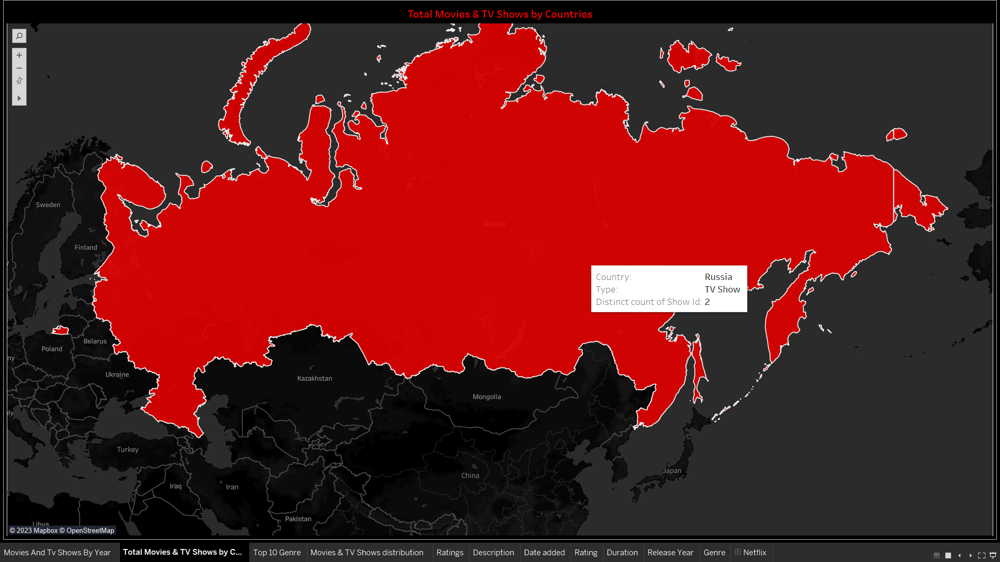
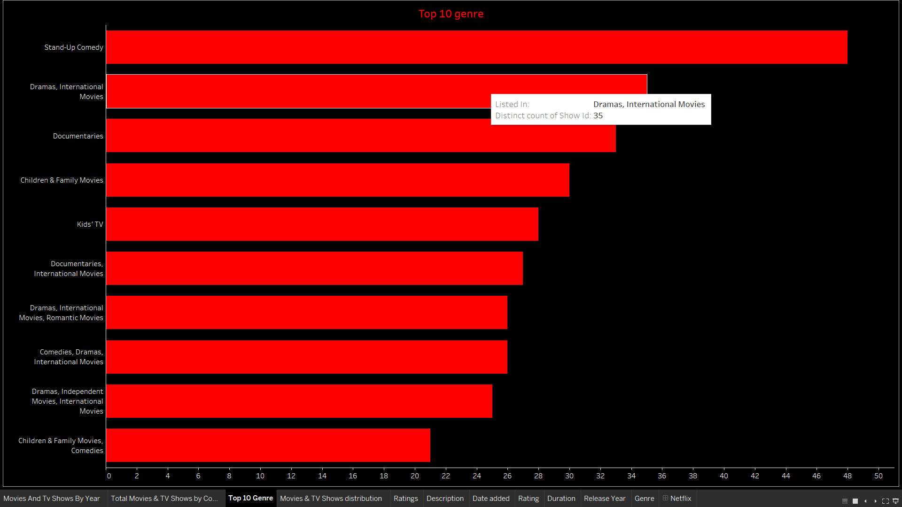
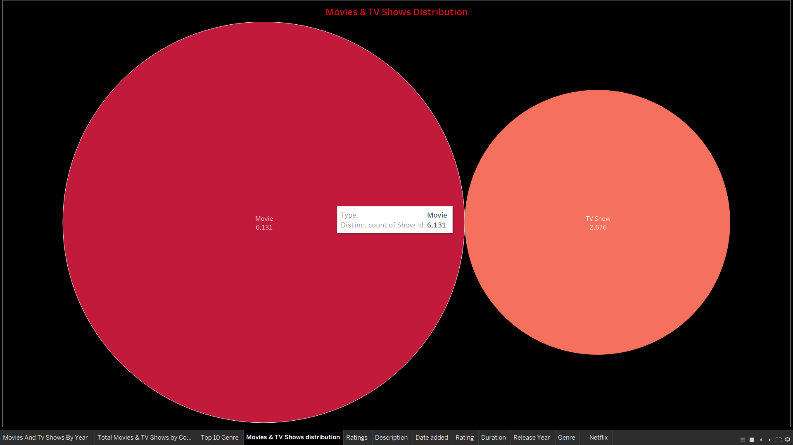
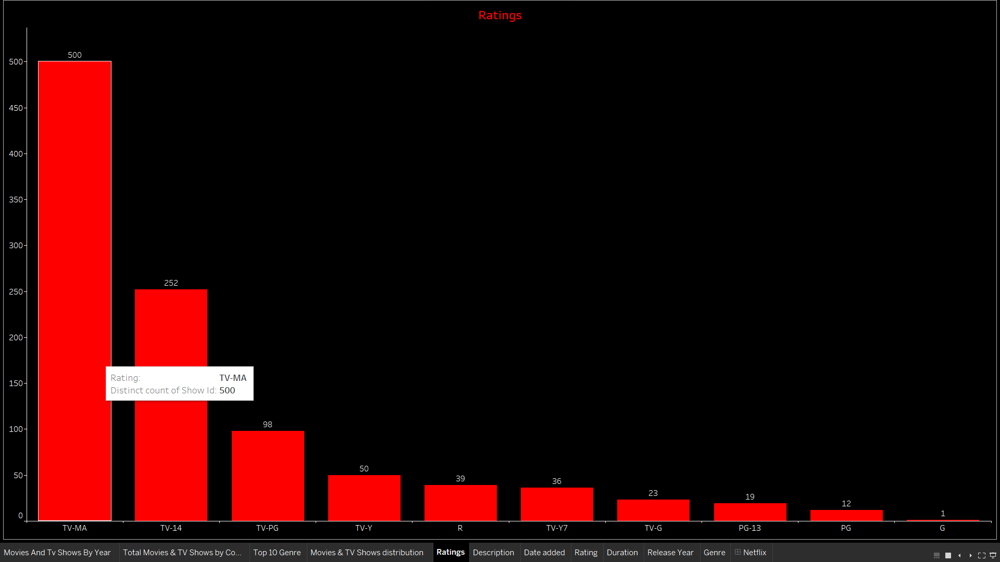
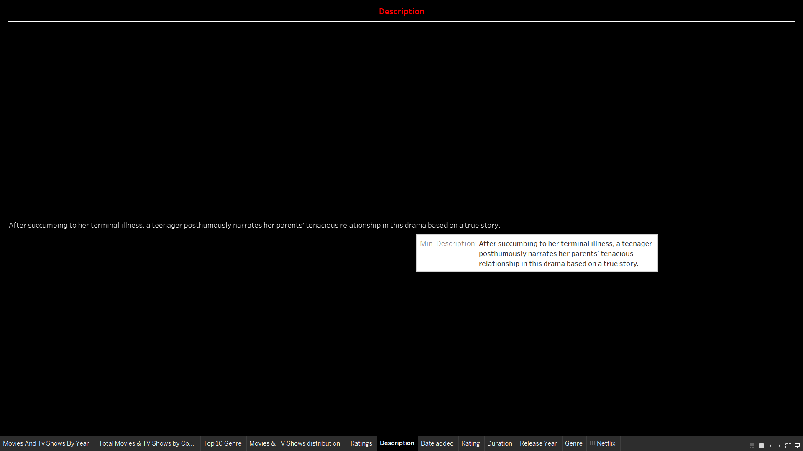

# Netflix Dashboard

A Tableau-based dashboard for tracking your Netflix viewing activity, managing your favorite shows and movies, and discovering new content.

## Features
A netflix dashboard is a visual representation of the data related to the netflix movies and TV shows, such as ratings, genres, countries, release years, etc. It can help you analyze the trends, patterns, and preferences of the netflix users and content providers. A netflix dashboard can also be interactive, allowing you to filter, sort, and drill down on the data.

## Total movies and tv shows by year :

## Total movies and tv shows by countries:

## Top 10 genre:

## Movies and tv shows distibution:

# Rating:

